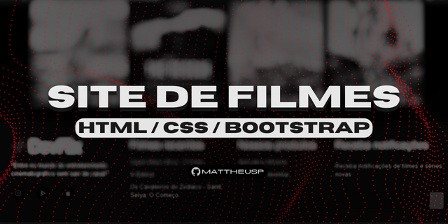

# Site de Filmes 🎬

Este repositório contém o código-fonte e os recursos necessários para criar um site de filmes. O site permite aos usuários pesquisar, visualizar detalhes e avaliar filmes.

## Funcionalidades 🔴

- Pesquisa de filmes por título, gênero ou ano de lançamento.
- Visualização dos detalhes de um filme, incluindo sinopse, elenco e avaliações dos usuários.
- Avaliação de filmes por parte dos usuários.
- Classificação dos filmes por popularidade, avaliações dos usuários e lançamentos recentes.

## Tecnologias Utilizadas 🛠️

O site de filmes foi desenvolvido utilizando as seguintes tecnologias:

- HTML5
- CSS3
- Bootstrap

## Link do projeto
- Acesse o resultado final no Vercel `https://dev-flix-seven.vercel.app/`.

# Contribuição

Agradecemos seu interesse em contribuir para o projeto do Site de Filmes! Aqui estão algumas diretrizes sobre como você pode participar do desenvolvimento e melhorar ainda mais o projeto.

## Processo de Contribuição

1. Faça um fork deste repositório para sua própria conta.
2. Crie uma branch para sua feature ou correção de bug: `git checkout -b minha-feature`.
3. Implemente as alterações desejadas no código, adicione novos recursos ou corrija erros existentes. Certifique-se de seguir as boas práticas de desenvolvimento.
4. Teste suas alterações para garantir que tudo esteja funcionando corretamente.
5. Documente as mudanças no arquivo README.md, se necessário.
6. Faça commit das suas alterações: `git commit -m "Descrição das alterações"`.
7. Faça push para o seu repositório remoto: `git push origin minha-feature`.
8. Abra um pull request neste repositório, descrevendo suas alterações e explicando os benefícios que elas trazem para o projeto.

## Contato ✉️

- E-mail: mattheusp382@gmail.com
- LinkedIn: [Mattheus-Pereira](https://www.linkedin.com/in/mattheuspereira/)
- Instagram - https://www.instagram.com/mattheusp_dev/
- Portfólio: [seu-website.com](https://www.seu-website.com)

## Licença ⚖️

Este portfolio é licenciado sob a Licença MIT.